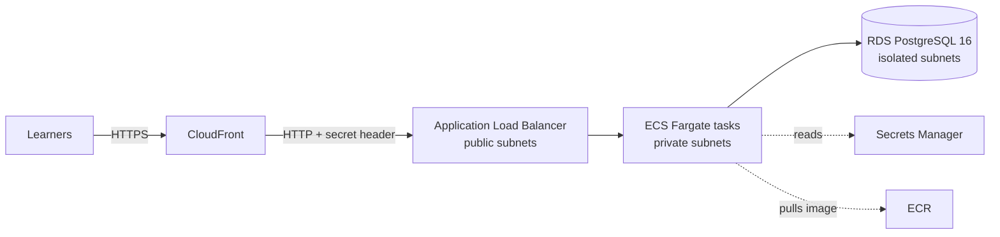

# Deploying KubeLearn to AWS

The whole cloud setup is defined as code in `infra/` with the AWS CDK (TypeScript). One command builds the Docker image, pushes it to Amazon ECR and creates or updates every resource. Commands are written for **Windows 11 / PowerShell**.

## Architecture



| Resource | Configuration |
|----------|---------------|
| VPC | 2 Availability Zones: public, private (app) and isolated (database) subnets, 1 NAT gateway |
| RDS PostgreSQL 16 | `db.t4g.micro`, encrypted, 7-day backups, deletion protection, final snapshot on delete. Single-AZ unless you pass `-c multiAz=true` |
| ECS Fargate | 0.5 vCPU / 1 GiB per task, 2–6 tasks, scales at 60 % CPU, rolls back failed deployments automatically |
| Application Load Balancer | Returns `403` unless the request carries CloudFront's secret `X-Origin-Verify` header |
| CloudFront | HTTPS for learners, HTTP/2 and HTTP/3, caches `/_next/static/*`, everything else passes through uncached |
| Secrets Manager | Database credentials, `NEXTAUTH_SECRET` and the origin header value, all generated at deploy time |
| CloudWatch Logs | Application and PostgreSQL logs, kept for 1 month |

Every resource is tagged `project=kubelearn` so you can filter costs in AWS Cost Explorer.

### What happens when a container starts

1. Builds `DATABASE_URL` from the database secret.
2. Runs `prisma migrate deploy` to apply any new migrations.
3. Seeds the course content (`SEED_ON_START=true`). The seed takes a database lock, so several tasks starting together is safe, and it never touches learners' progress.
4. Starts the Next.js server.

You never run migrations or seeds by hand in AWS.

## Cost estimate

A rough guide for `us-east-1` with low traffic. Check the [AWS Pricing Calculator](https://calculator.aws/) for your region.

| Item | Approx. per month |
|------|-------------------|
| NAT gateway | ~$33 |
| Fargate, 2 tasks running all the time | ~$36 |
| Application Load Balancer | ~$16 |
| RDS `db.t4g.micro` + 20 GB storage | ~$15 |
| Secrets Manager (3 secrets) | ~$1.20 |
| CloudFront, CloudWatch, ECR | usage based, a few dollars |
| **Total** | **about $100–110** |

`-c multiAz=true` roughly doubles the RDS cost.

## 1. Prerequisites

| Tool | Why | Check with |
|------|-----|------------|
| An AWS account | Where everything is created | |
| [AWS CLI v2](https://docs.aws.amazon.com/cli/latest/userguide/getting-started-install.html) | Credentials for CDK | `aws --version` |
| [Node.js](https://nodejs.org/) 22 | Runs the CDK app | `node -v` |
| [Docker Desktop](https://www.docker.com/products/docker-desktop/), running | CDK builds the `linux/amd64` app image locally | `docker version` |

Sign in to AWS with a user or role that can create the resources above (for a first deploy, an administrator):

```powershell
# Option A: access keys; prompts for key ID, secret key, default region (e.g. us-east-1) and output format
aws configure
# Option B: IAM Identity Center (SSO); prompts for your SSO start URL and account/role
aws configure sso
# Confirm which account and identity CDK will deploy with
aws sts get-caller-identity
```

If you use an SSO profile, run `$env:AWS_PROFILE="your-profile-name"` in the same PowerShell window before the CDK commands.

## 2. First deployment

```powershell
# Move into the CDK project
cd infra
# Install the exact CDK versions from package-lock.json
npm ci
# One-time setup per account and region: creates the bucket, ECR repository and roles CDK deploys with
npx cdk bootstrap
# Optional: list every resource that will be created, without changing anything
npx cdk diff
# Build the image, push it to ECR and create the stack; answer "y" when asked to approve IAM and security group changes
npx cdk deploy
```

The first deployment takes about **20–30 minutes**, mostly for RDS and CloudFront. When it finishes it prints:

```text
Outputs:
KubeLearnStack.AppUrl = https://d1234abcd.cloudfront.net
```

Open that URL. The first container seeds all the course content. There is **no demo account in the cloud**, so click **Register** to create your user.

### Choosing the region

The stack deploys to the region of your AWS credentials, or `us-east-1` if none is set:

```powershell
# Deploy to Frankfurt instead, for this PowerShell window only
$env:CDK_DEFAULT_REGION="eu-central-1"
# Bootstrap is per region, so run it once for the new region
npx cdk bootstrap
# Deploy into the new region
npx cdk deploy
```

If you use Azure DevOps, change `awsRegion` in `azure-pipelines.yml` to match.

### Standby database in a second Availability Zone

```powershell
# Adds a synchronous standby that RDS fails over to automatically
npx cdk deploy -c multiAz=true
```

Pass the same flag on every later deploy, or CDK switches the database back to Single-AZ.

## 3. Deploying updates

Run `npx cdk deploy` again from `infra/`, or push to `main` if the Azure DevOps pipeline is set up. CDK rebuilds the image only when files changed. ECS then replaces the tasks one by one:

- New tasks apply migrations and re-seed content before they start serving.
- A task that fails the load balancer health check stops the rollout. The ECS deployment circuit breaker rolls back to the previous version.
- Migrations only move forward. A rollback doesn't undo a migration that already ran, so keep schema changes backwards compatible (add columns before you use them, remove them in a later release).

## 4. Continuous deployment with Azure DevOps

`azure-pipelines.yml` has two stages:

| Stage | Runs on | Does |
|-------|---------|------|
| Validate | Every push and pull request to `main` | `npm ci`, lint, type-check, build, and type-check `infra/` |
| Deploy | Pushes to `main`, after Validate passes | `cdk bootstrap` and `cdk deploy --require-approval never` |

### Set it up

1. In Azure DevOps, create a pipeline from the repository and pick the existing `azure-pipelines.yml`.
2. Install the **[AWS Toolkit for Azure DevOps](https://marketplace.visualstudio.com/items?itemName=AmazonWebServices.aws-vsts-tools)** extension in your organization. It provides the `AWSShellScript@1` task.
3. Go to **Project settings → Service connections → New → AWS** and name it `aws-kubelearn`. If you use a different name, change `awsServiceConnection` in the pipeline. Use an IAM user's access keys, or better, a role the connection assumes.
4. Go to **Pipelines → Environments** and open `kubelearn-production` (created by the first run). Add an **Approvals** check so a person confirms each production deploy.

### Permissions for the pipeline identity

The simplest option is to give the service connection administrator rights. A tighter option:

1. Run `npx cdk bootstrap` once yourself, as an administrator, from your machine.
2. Give the pipeline's IAM user or role only this permission. CDK assumes the bootstrap roles, and those do the actual work:

   ```json
   {
     "Version": "2012-10-17",
     "Statement": [
       {
         "Effect": "Allow",
         "Action": "sts:AssumeRole",
         "Resource": "arn:aws:iam::<ACCOUNT_ID>:role/cdk-hnb659fds-*"
       }
     ]
   }
   ```

3. Remove the `npx cdk bootstrap` line from the pipeline, because bootstrapping needs broader rights.

## 5. Operating the app

### Logs

```powershell
# Find the log groups this stack created (application and PostgreSQL)
aws logs describe-log-groups --log-group-name-prefix KubeLearnStack --query "logGroups[].logGroupName"
# Stream the application logs live; paste a name from the previous command
aws logs tail <log-group-name> --follow
# Show only the last hour, for example after a failed deployment
aws logs tail <log-group-name> --since 1h
```

You can also view them in the AWS console under **ECS → Clusters → KubeLearnStack… → Service → Logs**.

### The database

RDS is in isolated subnets with no internet route. Only the app's security group can reach it, so you can't connect from your laptop. The generated credentials are in Secrets Manager; list the stack's secrets with `aws secretsmanager list-secrets --filters Key=tag-value,Values=kubelearn --query "SecretList[].Name"`. Storage starts at 20 GB and grows automatically up to 100 GB. Snapshots can be restored from **RDS → Snapshots**.

### Scaling

The service runs 2–6 tasks and scales on CPU. To change the limits or the task size, edit `minCapacity`, `maxCapacity`, `cpu` and `memoryLimitMiB` in `infra/lib/constructs/app-service.ts` and deploy again.

### HTTPS and custom domains

Learners always use HTTPS to CloudFront. The hop from CloudFront to the load balancer is HTTP, protected by the secret header, because the load balancer has no certificate of its own. To use your own domain (for example `learn.example.com`) and encrypt that hop too, you'd add a Route 53 hosted zone and ACM certificates. That isn't part of this stack yet.

## 6. Removing everything

The database has deletion protection, so turn that off first:

```powershell
# Find the database's identifier
aws rds describe-db-instances --query "DBInstances[?contains(DBInstanceIdentifier, 'kubelearn')].DBInstanceIdentifier"
# Turn off deletion protection right away
aws rds modify-db-instance --db-instance-identifier <db-identifier> --no-deletion-protection --apply-immediately
# Move into the CDK project
cd infra
# Delete the stack and everything in it; answer "y" to confirm
npx cdk destroy
```

What stays behind on purpose:

- **A final RDS snapshot.** It holds all learner data and is still billed. Delete it under **RDS → Snapshots** when you no longer need it.
- **The `CDKToolkit` stack** from `cdk bootstrap`, which is shared by all CDK apps in the account and region. Delete it in CloudFormation only if nothing else uses CDK there.

## Troubleshooting

| Problem | Fix |
|---------|-----|
| `Cannot connect to the Docker daemon` during deploy | Start Docker Desktop and wait until it says it's running. |
| `This stack uses assets, so the toolkit stack must be deployed` | Run `npx cdk bootstrap` for this account and region. |
| `Unable to resolve AWS account` | Your credentials are missing or expired. Run `aws sts get-caller-identity`, and `aws sso login` for SSO. |
| Deploy stays at "ECS service … in progress" and then rolls back | New tasks are failing health checks. Read the application logs (section 5). Common causes: a migration error or an unreachable database. |
| `403 Forbidden` when opening the load balancer's own DNS name | Expected. Only CloudFront may reach it; use the `AppUrl` output. |
| `502` or `504` from CloudFront right after the first deploy | Tasks are still migrating and seeding. Wait a minute or two. |
| Signing in redirects to the wrong URL | `NEXTAUTH_URL` comes from the CloudFront domain. Deploy again after changing domains so tasks pick up the new value. |
| `cdk destroy` fails on the database | Deletion protection is still on. Run the `modify-db-instance` command in section 6. |
